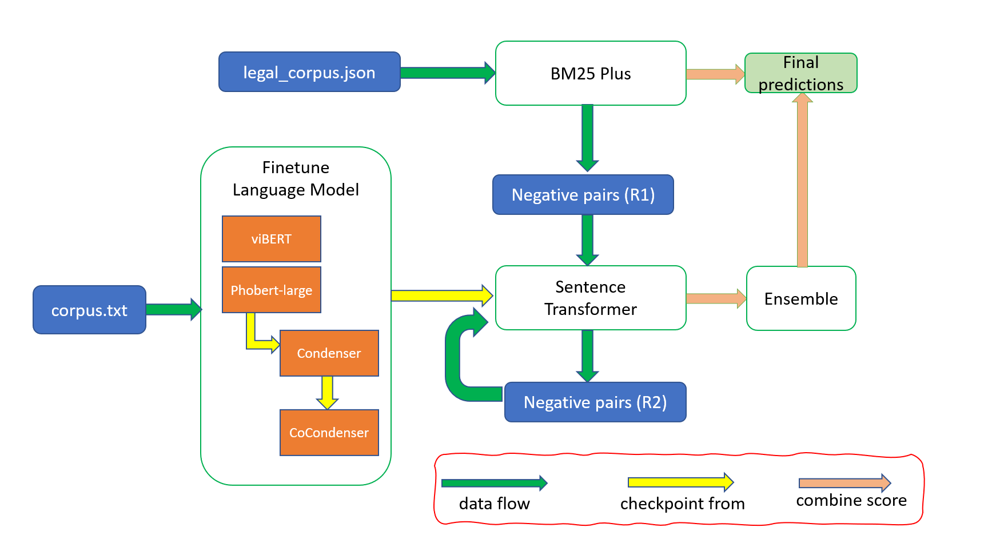

# Vietnamese Legal Text Retrieval

**Kết quả thực nghiệm đạt được:** 

- Notebook Kaggle: https://www.kaggle.com/code/hmthanh/condenser-qa2021 
- HuggingfaceModel : https://huggingface.co/hmthanh/VietnamLegalText-SBERT 
- Github Condenser: https://github.com/hmthanh/zalo_ltr_2021 

#### Dataset: Legal Text Retrieval

https://www.kaggle.com/datasets/hmthanh/legal-text-retrieval?select=zac2021-ltr-data 

Mã nguồn thực hành của Condenser 

* Nhóm tiến hành tham khảo mã nguồn từ bài toán Legal Text Retrieval từ cuộc thi Zalo AI 2021 của CuongNN218. https://github.com/CuongNN218/zalo_ltr_2021 

* Mã nguồn của CuongNN218 được chạy trên con máy có 4 GPU A1000

## Bài toán Zalo AI 2021: Legal Text Retrieval 

#### Input: 

- Câu hỏi (VD: ”Trường hợp nào được miễn tham gia bồi dưỡng nghiệp vụ công chứng hàng năm?”) 
- Corpus: 
  - Các văn bản luật với law_id (VD : ”01/2021/tt-ttcp”) 
  - Nội dung mỗi văn bản luật gồm nhiều điều luật 
    Các điều luật article phân biệt bởi article_id ("1", "2"): 
    - Tên điều luật - title ("Điều 1. Phạm vi điều chỉnh") 
    - Nội dung điều luật - text ("Thông tư này quy định quy tắc ứng xử chung, ứng xử trong thực hiện nhiệm vụ thanh tra, giải quyết khiếu nại, tố cáo phòng, chống tham nhũng trong ngành Thanh tra và trong thực hiện nhiệm vụ tiếp công dân.") 

### Output: 

* Trả ra null hoặc danh sách một hoặc nhiều các văn bản luật của điều luật tương ứng với câu hỏi. 
  * Văn bản luật (VD : "law_id": "195/2013/nđ-cp") 
  * Điều luật (VD : "article_id": "17") 

 

## Mục tiêu thực hiện: 

Xếp hạng điểm số trong các câu trong Corpus, và đánh giá độ giống nhau dựa trên cosine similarity score. 

* **Round1**: Dùng BM25 để làm Negative sample cho việc training Contrastive loss. 

* **Round2**: Dùng Sentence Transfomer mà dự đoán false positive để làm Negative sample cho việc training Contrastive loss. 

    

 

## Các bước thực hiện: 

#### 1. Training Condenser 

Lấy các mô hình có sẵn trên Huggingface như VinAI/PhoBERT, FPTAI/ViBERT để Fine-tune trước để được các mô hình Condenser và CoCondenser. 2.

#### 2. Training Sentence Transformer + Contrastive loss 

(Là đưa các câu positive lại gần, đưa các mẫu negative ra xa): 

* Dữ liệu của contractive loss: 

  - Positive sample: 
    Lấy từ data answer (câu trả lời) của ban tổ chức cuộc thi. 

  - Negative sample: 
    Dùng BM25 để tìm ra 50 hoặc 20 cặp câu giống nhau với câu hỏi nhất và gán là Negative sample. 

* Sử dụng các mô hình  PhoBERT, ViBERT đã fine-tune Condenser và CoCondenser để training Contractive loss với nhãn đã chuẩn bị. 

#### 3. Hard negative mining:  

(Là dùng những câu được dự đoán false positive và gán là negative để tiếp tục training - mục tiêu để model fix các lỗi sai positive) 

* Dùng models trên dự đoán top 20 cặp trong training data có cosine-similarity scores cao nhất cho từng model.  

* Lưu lại các cặp câu này để training tiếp round 2 cho sentence transformer. 

#### 4. Training Sentence Transformer + Contrastive loss 

Với dữ liệu được sinh ra từ Step 3. 

* Positive sample: Lấy từ data answer (câu trả lời) của ban tổ chức cuộc thi. 

* Negative sample: Lấy từ step 3. 

#### 5. Ensemble 

* Esemble các mô hình trên với BM25 

#### 6. Tính final score 

- BERT_score = ∑ w_i * cos_sim_model_i 

- BM25_score = BM25 score của từng câu hỏi 

- Final score = BM25_score * BERT_score 

#### 7. Post-processing: 

* Loại bỏ 1 số trường hợp sai điều luật: 
  * nd-, nđ-cp (chữ đ ở 1 dạng kí tự khác)  nđ-cp -> nd-cp 
  * 09/2014/ttlt-btp-tandtc-vksndtc -> 09/2014/ttlt-btp-tandtc-vksndtc-btc. 
* Chỉ lấy tối đa 5 câu trong khoảng [max_score - 2.6, max_score]. 
